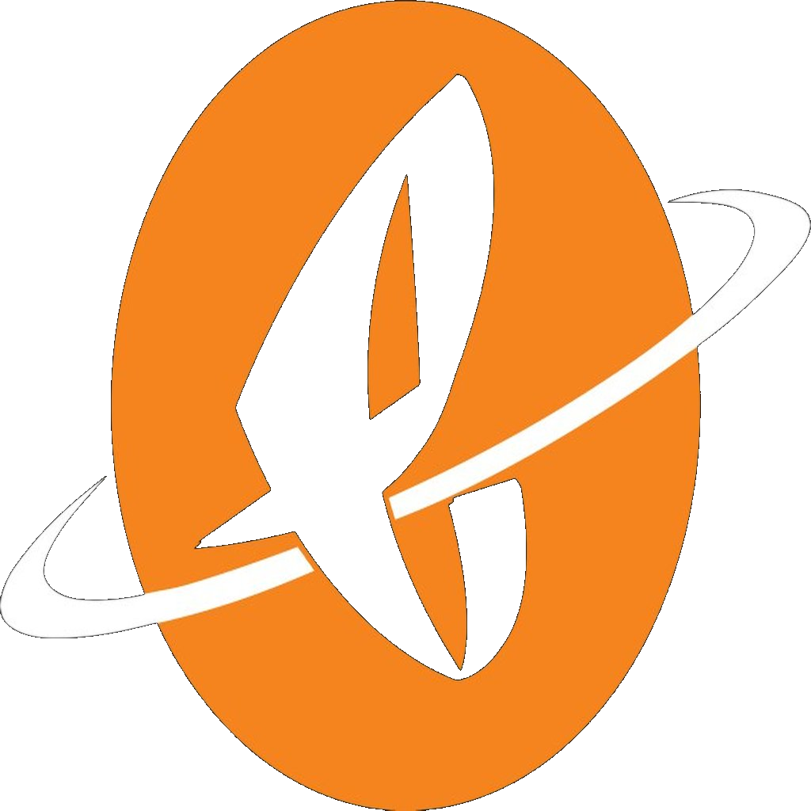

# 🏦 Generational Wealth Game

> **Learn how to become your own bank using the power of Whole Life Insurance Policies.**

---

## 📖 What Is This?

The **Generational Wealth Game** is an open-source educational platform that teaches individuals and families how to build lasting, generational wealth by leveraging the **Infinite Banking Concept (IBC)** — a strategy popularized by Nelson Nash in *Becoming Your Own Banker*.

Instead of relying on traditional banks, you learn to:
- Use **dividend-paying whole life insurance** as your personal banking system
- Grow your money in a **tax-advantaged, guaranteed** environment
- Borrow against your own policy for **major purchases, investments, and opportunities**
- Pass on a **tax-free legacy** to the next generation

---

## 🎯 Who Is This For?

- Individuals looking to break free from the traditional banking system
- Parents and grandparents focused on multi-generational wealth planning
- Entrepreneurs who want to finance their businesses without banks
- Anyone curious about the Infinite Banking Concept

---

## 📚 What You'll Learn

| Module | Topic |
|--------|-------|
| 01 | The Problem with Traditional Banking |
| 02 | Introduction to Whole Life Insurance |
| 03 | How Dividend-Paying Policies Work |
| 04 | Setting Up Your Personal Bank (IBC) |
| 05 | Policy Loans — How to Borrow from Yourself |
| 06 | Real-Life Use Cases & Strategies |
| 07 | Multi-Generational Wealth Planning |
| 08 | Building a Legacy Portfolio |

---

## 📁 Repository Structure

```
generational-wealth-game/
├── lessons/          # Step-by-step educational modules
├── resources/        # Guides, PDFs, templates & references
├── tools/            # Calculators, worksheets & planning tools
├── docs/             # Deep-dive documentation & case studies
└── README.md
```

---

## 🚀 Getting Started

1. **Clone the repo**
   ```bash
   git clone https://github.com/cryptofedge/generational-wealth-game.git
   ```
2. Start with `lessons/01-the-banking-problem.md`
3. Work through each module at your own pace
4. Use the `tools/` folder to run your own numbers

---

## 💡 The Core Concept

> *"The Infinite Banking Concept is simply the process of becoming your own banker — using a dividend-paying whole life insurance policy as your financial foundation."*
> — Nelson Nash, *Becoming Your Own Banker*

By recapturing the interest you currently pay to banks and finance companies, you redirect that wealth back into your own policy — compounding it for **you and your family**, not the bank.

---

## 🤝 Contributing

Contributions are welcome! Whether you're a financial educator, policy expert, or someone on their own IBC journey — your insights can help others.

1. Fork the repo
2. Create a feature branch: `git checkout -b feature/your-lesson`
3. Commit your changes
4. Open a Pull Request

Please read our contributing guidelines in `docs/CONTRIBUTING.md`.

---

## ⚠️ Disclaimer

This project is for **educational purposes only**. Nothing here constitutes financial, legal, or tax advice. Always consult with a licensed financial professional before making decisions about life insurance or investment strategies.

---

## 📜 License

This project is licensed under the **MIT License** — see [LICENSE](LICENSE) for details.

---

<p align="center">
  <strong>Build wealth that lasts beyond your lifetime. 💰</strong><br/>
  Made with ❤️ for those who want to play the long game.
</p>

---

## 📋 License & Brand



### FEDGE 2.O | Powered by Rafael Fellito Rodriguez & Eclat Universe

**© 2026 FEDGE 2.O. All rights reserved.**

This project is part of the FEDGE 2.O ecosystem and is protected under full intellectual property rights reserved by Rafael Fellito Rodriguez and Eclat Universe.

### License Details

- **Type:** Proprietary - All Rights Reserved
- **Owner:** Rafael Fellito Rodriguez & Eclat Universe
- **Brand:** FEDGE 2.O
- **Status:** Protected & Confidential

### Key Rights

✓ **All intellectual property retained**
✓ **Reproduction prohibited without permission**
✓ **Distribution rights reserved**
✓ **Derivative works not permitted**
✓ **Commercial use requires authorization**

### Attribution

When referencing this software, please include:
- FEDGE 2.O
- Rafael Fellito Rodriguez
- Eclat Universe

### Inquiries

For licensing, partnerships, or usage permissions:
📧 **cryptofedge@gmail.com**

---

**Learn more:** [Full License](LICENSE)

---

---

## 📋 License & Brand


### FEDGE 2.O | Powered by Rafael Fellito Rodriguez & Eclat Universe

**© 2026 FEDGE 2.O. All rights reserved.**

This project is part of the FEDGE 2.O ecosystem and is protected under full intellectual property rights reserved by Rafael Fellito Rodriguez and Eclat Universe.

### License Details

- **Type:** Proprietary - All Rights Reserved
- **Owner:** Rafael Fellito Rodriguez & Eclat Universe
- **Brand:** FEDGE 2.O
- **Status:** Protected & Confidential

### Key Rights

✓ **All intellectual property retained**
✓ **Reproduction prohibited without permission**
✓ **Distribution rights reserved**
✓ **Derivative works not permitted**
✓ **Commercial use requires authorization**

### Attribution

When referencing this software, please include:
- FEDGE 2.O
- Rafael Fellito Rodriguez
- Eclat Universe

### Inquiries

For licensing, partnerships, or usage permissions:
📧 **cryptofedge@gmail.com**

---

**Learn more:** [Full License](LICENSE)

---

**Learn more:** [Full License](LICENSE)

---

---

## License & Brand


### FEDGE 2.O | Powered by Rafael Fellito Rodriguez & Eclat Universe

**© 2026 FEDGE 2.O. All rights reserved.**

This project is part of the FEDGE 2.O ecosystem and is protected under full intellectual property rights reserved by Rafael Fellito Rodriguez and Eclat Universe.

### License Details

- **Type:** Proprietary - All Rights Reserved
- **Owner:** Rafael Fellito Rodriguez & Eclat Universe
- **Brand:** FEDGE 2.O
- **Status:** Protected & Confidential

### Key Rights

- All intellectual property retained
- Reproduction prohibited without permission
- Distribution rights reserved
- Derivative works not permitted
- Commercial use requires authorization

### Attribution

When referencing this software, please include:
- FEDGE 2.O
- Rafael Fellito Rodriguez
- Eclat Universe

### Inquiries

For licensing, partnerships, or usage permissions:
📧 **cryptofedge@gmail.com**

---


---

## License & Brand


### FEDGE 2.O | Powered by Rafael Fellito Rodriguez & Eclat Universe

© 2026 FEDGE 2.O. All rights reserved.

This project is part of the FEDGE 2.O ecosystem and is protected under full intellectual property rights reserved by Rafael Fellito Rodriguez and Eclat Universe.

### License Details

- **Type:** Proprietary - All Rights Reserved
- **Owner:** Rafael Fellito Rodriguez & Eclat Universe
- **Brand:** FEDGE 2.O
- **Status:** Protected & Confidential

### Key Rights

- All intellectual property retained
- Reproduction prohibited without permission
- Distribution rights reserved
- Derivative works not permitted
- Commercial use requires authorization

### Attribution

When referencing this software, please include:
- FEDGE 2.O
- Rafael Fellito Rodriguez
- Eclat Universe

### Inquiries

For licensing, partnerships, or usage permissions:
cryptofedge@gmail.com

---

Learn more: [Full License](LICENSE)

---
